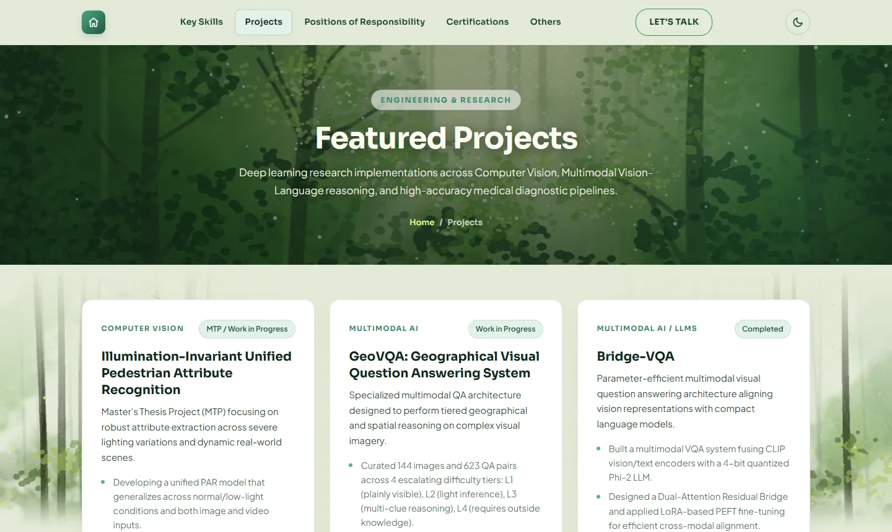
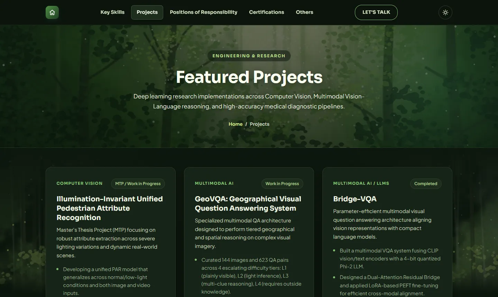

<div align="center">

# 🌿 Sagnik Kayal — Portfolio

**M.Tech (Artificial Intelligence) scholar at IIT Bhubaneswar**
Computer Vision · Multimodal Learning · LLM Fine-Tuning

### [🔗 sagnik2003.github.io/portfolio](https://sagnik2003.github.io/portfolio)

</div>

<p align="center">
  
  
</p>

---

## About

My personal website: my academic journey, research projects, skills, roles and
certifications, all in one place. It's designed around a calm, forest-inspired
theme with hand-generated watercolour artwork.

## What's inside

| Page | What you'll find |
| --- | --- |
| **Home** | Introduction, the full academic timeline (school → B.Tech → M.Tech at IIT Bhubaneswar), and a portfolio directory |
| **Key Skills** | Languages, ML/DL frameworks, research areas, tools and spoken languages |
| **Projects** | Pedestrian Attribute Recognition (MTP), GeoVQA, Bridge-VQA, Parkinson's detection, ELVE-Retinex, brain-tumour segmentation and more |
| **Positions of Responsibility** | Teaching Assistant (IIT Bhubaneswar), AstroML course instructor, and other roles |
| **Certifications** | Coursera / DeepLearning.AI specialisations with verification links |
| **Others** | Interests and notable achievements |
| **Contact** | Email, LinkedIn, GitHub and LeetCode |

## Features

- **Watercolour forest artwork**: a sunlit forest-clearing painting in the headers and misty forest panels behind the content, all generated procedurally with feathered edges that blend into the page.
- **"Walk into the light" scroll animation**: the forest pushes in toward the sunlit clearing, the intro text peels away line by line, and the Academic Journey emerges from the light.
- **Self-drawing timeline**: the timeline line draws itself as you read, and cards tilt into place.
- **Light & dark mode**: dark mode turns the fog a deep sap green. The choice is remembered, and first-time visitors get their system theme.
- **Responsive**: works on desktop, tablet and phone.
- **Accessible motion**: animations are turned off for visitors who prefer reduced motion.
- **Photo protection**: the portrait is stored only as a shuffled tile sheet (`images/hero-tiles.webp`) and re-assembled on a `<canvas>` in the browser, so there is no downloadable copy in this repository.

## Tech stack

Plain **HTML**, **CSS** and **vanilla JavaScript**: no frameworks, no build step,
no dependencies. Fonts come from Google Fonts (Sora, Plus Jakarta Sans and The Nautigal).
Hosted on **GitHub Pages**.

## Project structure

```
├── index.html            # Home: hero, academic timeline, portfolio directory
├── skills.html           # Key Skills
├── projects.html         # Projects
├── positions.html        # Positions of Responsibility
├── certifications.html   # Certifications
├── others.html           # Interests & achievements
├── contact.html          # Contact
├── academic.html         # Standalone academic page
├── style.css             # All styles (theme tokens, dark mode, animations)
├── images/
│   ├── hero-tiles.webp       # Portrait, stored as shuffled tiles
│   ├── wc-hero-forest.webp   # Header watercolour
│   ├── wc-forest-*.webp      # Body watercolour panels
│   └── iitbbs_logo.svg
└── docs/                 # README previews
```

## Run locally

No setup needed. Clone the repo and open `index.html` in any browser:

```bash
git clone https://github.com/Sagnik2003/portfolio.git
cd portfolio
start index.html        # Windows  (macOS: open index.html)
```

## Customising

- **Colours:** every colour is a CSS variable at the top of `style.css`. Dark mode overrides them in the `DARK MODE` block at the end of the same file.
- **Content:** each section is a plain HTML page. Copy an existing card block (for example a `cert-card` in `certifications.html`) to add a new entry.

## Contact

📧 **25AI06021@iitbbs.ac.in** · [GitHub @Sagnik2003](https://github.com/Sagnik2003)

---

<sub>© Sagnik Kayal. All rights reserved. The content, photo and artwork are personal and may not be reused without permission.</sub>
